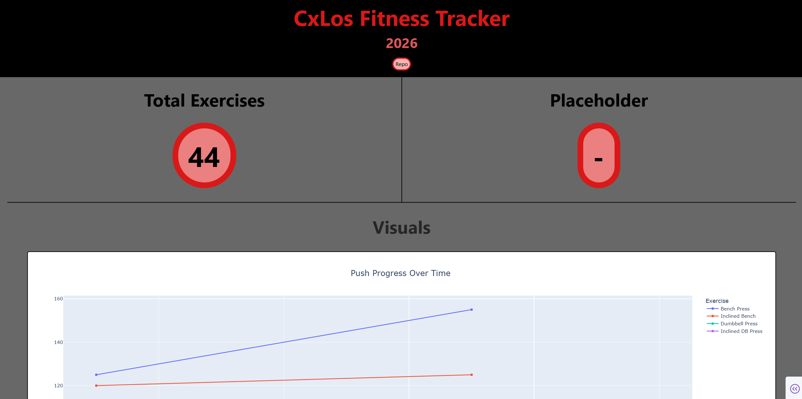

# 🏋🏽‍♂️ Jason Fitness Tracker

## 📝 Description 

A personal fitness tracking dashboard built with Python, Dash, and Plotly. This application logs workout data from a Google Sheet and visualizes progress across multiple muscle groups (Push, Pull, Leg, Bicep, Tricep, Shoulder, Forearm, and Ab exercises). Track your strength gains over time with interactive line charts organized by category.


## 📂 Table of Contents 
	
- [Installation](#-installation)
- [Usage](#️-usage)
- [Methodology](#-methodology)
- [Findings](#-findings)
- [Conclusion](#-conclusion)
- [License](#-license)

## 📦 Installation

To run this project locally, follow these steps:

1. Clone the repository:
    ```bash
    git clone https://github.com/CxLos/Jason_Fitness_Tracker
    ```
2. Navigate to the project directory:
    ```bash
    cd Jason_Fitness_Tracker
    ```
3. Install the required dependencies:
    ```bash
    pip install -r requirements.txt
    ```

## ▶️ Usage

- This is an interactive Plotly/Dash dashboard. Hover over any data point to see detailed exercise, date, and weight information. Zoom in/out to get a better view of specific time periods.

- To launch the dashboard, execute the following command in your terminal:

```bash
python app.py
```

The dashboard will be available at `http://127.0.0.1:8050/`

## 🌐 Live Demo

**[View Live Dashboard](https://jason-fitness-tracker.onrender.com/)**


## 🧪 Methodology

The data for this project is sourced directly from a Google Sheet where Jason logs personal fitness workouts. Each exercise is categorized by muscle group (Push, Pull, Leg, Bicep, Tricep, Shoulder, Forearm, Ab, and Calisthenics), with dates as columns and weight lifted as values.

The application uses:
- **Google Sheets API** via `gspread` for real-time data retrieval
- **Pandas** for data reshaping (wide to long format for visualization)
- **Plotly Express** for interactive line charts
- **Dash** for the web dashboard interface

## Plans for collected data:

- Calculate strength gains over time per exercise
- Identify plateau periods and recovery trends
- Compare progress across muscle groups
- Generate weekly/monthly workout reports
- Implement body weight tracking

## 🔍 Findings

* Weight progression shows consistent improvement across all major lifts
* Pull exercises show the most steady linear progression
* Exercise consistency correlates with faster strength gains

## ✅ Conclusion

This fitness tracker provides a visual way to monitor strength progress and stay motivated by seeing improvements over time. The interactive dashboard makes it easy to identify trends and celebrate achievements.


## 📄 License

MIT License

Copyright (c) 2026 CxLos

Permission is hereby granted, free of charge, to any person obtaining a copy
of this software and associated documentation files (the "Software"), to deal
in the Software without restriction, including without limitation the rights
to use, copy, modify, merge, publish, distribute, sublicense, and/or sell
copies of the Software, and to permit persons to whom the Software is
furnished to do so, subject to the following conditions:

The above copyright notice and this permission notice shall be included in all
copies or substantial portions of the Software.

THE SOFTWARE IS PROVIDED "AS IS", WITHOUT WARRANTY OF ANY KIND, EXPRESS OR
IMPLIED, INCLUDING BUT NOT LIMITED TO THE WARRANTIES OF MERCHANTABILITY,
FITNESS FOR A PARTICULAR PURPOSE AND NONINFRINGEMENT. IN NO EVENT SHALL THE
AUTHORS OR COPYRIGHT HOLDERS BE LIABLE FOR ANY CLAIM, DAMAGES OR OTHER
LIABILITY, WHETHER IN AN ACTION OF CONTRACT, TORT OR OTHERWISE, ARISING FROM,
OUT OF OR IN CONNECTION WITH THE SOFTWARE OR THE USE OR OTHER DEALINGS IN THE
SOFTWARE.
